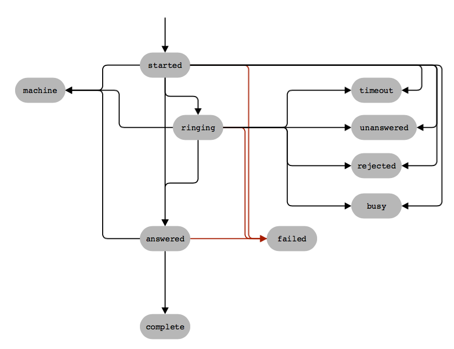

# Call States 

In this guide we are going to explain call states like started, ringing, answered, rejected, busy, unanswered, timeout, failed, complete, machine. Since everyone is familiar with the phone, these concepts are pretty straightforward. 
 
Both inbound and outbound calls follow the same call flow once answered. This call flow is controlled by an NCCO. An NCCO is a script of actions to be run within the context of the call. Actions are executed in the order they appear in the script, with the next action starting when the previous action has finished executing. For more information about NCCOs, see the [NCCO reference](https://developer.nexmo.com/voice/voice-api/ncco-reference).

# Call States 

Each call goes through a sequence of states in its lifecycle:

A call may pass from Created to Ringing to Answered to Complete but there are many different sets of sequences for states in a call's lifecycle. Below is an schematic diagram outlining a few sets. 

### States

Here is list of of all eight of the call states: 

- **started** : The call is created on the Nexmo platform
- **ringing** : The destination has confirmed that the call is ringing
- **answered** : The destination has answered the call
- **rejected** : The call attempt was rejected by the Nexmo platform
- **busy**: The destination is on the line with another caller
- **unanswered**: The call was canceled from the called before an answer
- **timeout**: The call timed out before it was answered
- **failed**: The call attempt failed in the phone network
- **complete**: When a call has been completed successfully
- **machine**: When machine detection has been requested and the call is answered by a machine

These states are valid for all 1:1 call combinations such as (IP-IP, IP - PSTN, PSTN - IP, etc...). 

## Disclaimer 

While Nexmo, the Vonage API Platform strives to provide the best possible access how so ever it may be, we little to no control over assuring the accuracy of the changes in state, all of which depend in the largest part upon the carriers themselves, mostly separate legal entities with whom we share a business interest. More specifically, a state change may indeed be busy but is relayed as rejected. 